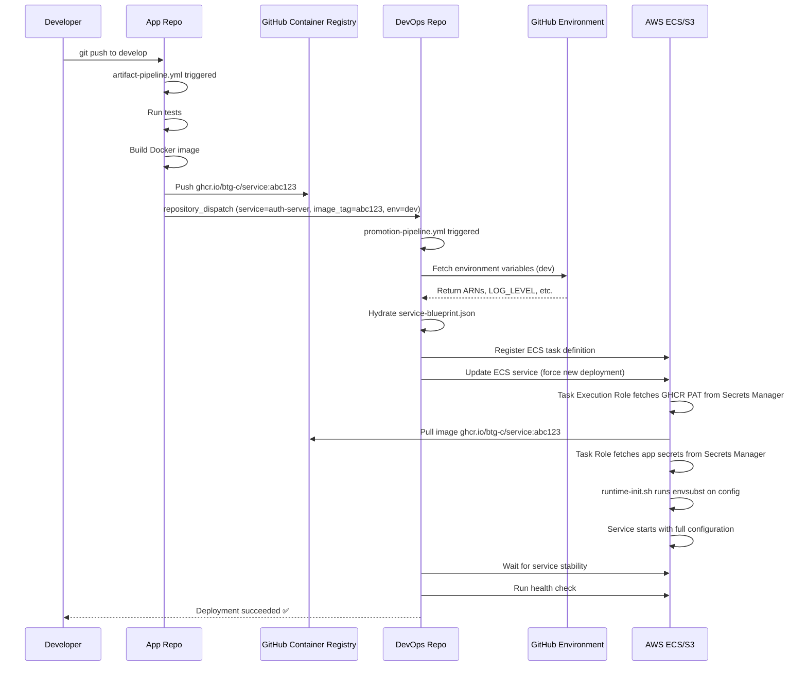

# Architecture Overview

**Understanding the 2026 Future-Proof Multi-Repo Immutable Pipeline**

---

## Table of Contents
1. [System Architecture](#system-architecture)
2. [Core Principles](#core-principles)
3. [Repository Strategy](#repository-strategy)
4. [Deployment Flow](#deployment-flow)
5. [Technology Stack](#technology-stack)
6. [Design Decisions](#design-decisions)

---

## System Architecture

### High-Level Diagram

```
┌──────────────────────────────────────────────────────────────────────────┐
│                           DEVELOPER WORKFLOW                             │
└──────────────────────────────────────────────────────────────────────────┘
                                    │
                        git push to main/develop
                                    ▼
┌──────────────────────────────────────────────────────────────────────────┐
│                         APPLICATION REPOSITORIES                         │
│  ┌─────────────┐  ┌─────────────┐  ┌─────────────┐  ┌───────────────┐  │
│  │btg-auth-    │  │btg-gateway- │  │btg-shell-   │  │btg-enhancer-  │  │
│  │server       │  │service      │  │mfe          │  │mfe            │  │
│  └─────────────┘  └─────────────┘  └─────────────┘  └───────────────┘  │
│       │                │                  │                  │           │
│    artifact-pipeline.yml (Build & Publish Immutable Artifacts)          │
│       │                │                  │                  │           │
└───────┼────────────────┼──────────────────┼──────────────────┼───────────┘
        │                │                  │                  │
        └────────────────┴──────────────────┴──────────────────┘
                                    │
                          repository_dispatch event
                                    ▼
┌──────────────────────────────────────────────────────────────────────────┐
│                        DEVOPS REPOSITORY (btg-devops)                    │
│                                                                          │
│  ┌────────────────────────────────────────────────────────────────┐    │
│  │              PROMOTION PIPELINE (Orchestration)                │    │
│  │  • Receive image_tag + service + environment                   │    │
│  │  • Fetch GitHub Environment variables                          │    │
│  │  • Hydrate service blueprint with ARNs                         │    │
│  │  • Deploy to AWS ECS / S3+CloudFront                           │    │
│  └────────────────────────────────────────────────────────────────┘    │
│                                                                          │
│  ┌─────────────────┐  ┌──────────────────┐  ┌───────────────────┐     │
│  │ services/       │  │ infrastructure/  │  │ docs/             │     │
│  │ - auth-server   │  │ - terraform      │  │ - architecture    │     │
│  │ - gateway       │  │ - scripts        │  │ - operations      │     │
│  │ - shell-mfe     │  │                  │  │ - security        │     │
│  │ - enhancer-mfe  │  │                  │  │ - development     │     │
│  └─────────────────┘  └──────────────────┘  └───────────────────┘     │
└──────────────────────────────────────────────────────────────────────────┘
                                    │
                                    ▼
┌──────────────────────────────────────────────────────────────────────────┐
│                         ARTIFACT STORAGE (GHCR)                          │
│  ghcr.io/btg-c/auth-server:abc123-20260113-143052                       │
│  ghcr.io/btg-c/gateway-service:def456-20260113-150234                   │
│  • Immutable tags (Git SHA + timestamp)                                 │
│  • One image for all environments                                       │
│  • Automatic vulnerability scanning                                     │
└──────────────────────────────────────────────────────────────────────────┘
                                    │
                                    ▼
┌──────────────────────────────────────────────────────────────────────────┐
│                    GITHUB ENVIRONMENTS (Config + Approvals)              │
│  ┌─────────────┐  ┌─────────────┐  ┌──────────────────────────┐        │
│  │ dev         │  │ staging     │  │ production               │        │
│  │ • Auto      │  │ • Auto      │  │ • Manual approval (2)    │        │
│  │ • No gates  │  │ • No gates  │  │ • 5 min wait timer       │        │
│  │ • ARNs      │  │ • ARNs      │  │ • ARNs                   │        │
│  └─────────────┘  └─────────────┘  └──────────────────────────┘        │
└──────────────────────────────────────────────────────────────────────────┘
                                    │
                                    ▼
┌──────────────────────────────────────────────────────────────────────────┐
│                           AWS INFRASTRUCTURE                             │
│  ┌────────────────────────────────────────────────────────────────┐    │
│  │ ECS FARGATE (Backend Services)                                 │    │
│  │  • Task Execution Role pulls GHCR PAT from Secrets Manager     │    │
│  │  • Container pulls image: ghcr.io/btg-c/service:tag            │    │
│  │  • runtime-init.sh hydrates config with envsubst               │    │
│  │  • Task Role fetches app secrets from Secrets Manager          │    │
│  │  • Service starts with full configuration                      │    │
│  └────────────────────────────────────────────────────────────────┘    │
│  ┌────────────────────────────────────────────────────────────────┐    │
│  │ S3 + CLOUDFRONT (Frontend MFEs)                                │    │
│  │  • Extract build artifact (tar.gz)                             │    │
│  │  • Deploy to S3 with cache headers                             │    │
│  │  • Invalidate CloudFront cache                                 │    │
│  │  • Inject runtime config.json (env-specific)                   │    │
│  └────────────────────────────────────────────────────────────────┘    │
│  ┌────────────────────────────────────────────────────────────────┐    │
│  │ AWS SECRETS MANAGER                                            │    │
│  │  • btg/dev/mongodb-uri                                         │    │
│  │  • btg/prod/oauth-client-secret                                │    │
│  │  • github/packages-pat (for GHCR pulls)                        │    │
│  └────────────────────────────────────────────────────────────────┘    │
└──────────────────────────────────────────────────────────────────────────┘
```

---

## Core Principles

### 1. Immutable Artifacts
**Build once, deploy many times**

```
Single Docker Image: ghcr.io/btg-c/auth-server:abc123
   │
   ├─> Deploy to dev     (using dev secrets)
   ├─> Deploy to staging (using staging secrets)
   └─> Deploy to prod    (using prod secrets)
```

**Benefits:**
- ✅ What you test in staging is exactly what runs in production
- ✅ No "works on my machine" issues
- ✅ Faster deployments (no rebuild)
- ✅ Easy rollback (redeploy previous tag)

### 2. Separation of Concerns
**Code vs Configuration**

| Repository | Responsibility | Contains |
|------------|----------------|----------|
| **App Repos** | Build artifacts | Source code, tests, Containerfile |
| **DevOps Repo** | Deploy artifacts | ECS task definitions, Terraform, secrets ARNs |

**Benefits:**
- ✅ Developers focus on features, not infrastructure
- ✅ DevOps controls deployment without touching app code
- ✅ Clear ownership boundaries
- ✅ Independent versioning

### 3. Zero Hardcoding
**All configs are injected at runtime**

**Bad (Hardcoded):**
```yaml
# application.yaml
spring:
  data:
    mongodb:
      uri: mongodb://prod-db.example.com:27017/btg_auth  ❌
```

**Good (Placeholder):**
```yaml
# application.template.yaml
spring:
  data:
    mongodb:
      uri: ${MONGODB_URI}  ✅
```

**Runtime Injection:**
```bash
# Container startup
envsubst < application.template.yaml > application.yaml
# MONGODB_URI fetched from AWS Secrets Manager by ECS
```

### 4. Environment Promotion
**Progressive deployment with gates**

```
develop branch      →  Auto-deploy to DEV
   ↓ (merge)
release/* branch    →  Auto-deploy to STAGING
   ↓ (manual trigger + approval)
main branch         →  Manual deploy to PRODUCTION (2 approvals required)
```

### 5. Least Privilege
**IAM roles scoped per environment**

```
dev-task-execution-role    → Can only read github/packages-pat
dev-task-role             → Can only read btg/dev/* secrets

prod-task-execution-role  → Can only read github/packages-pat
prod-task-role            → Can only read btg/prod/* secrets
```

**Result:** Dev environment can't access prod secrets (even if compromised)

---

## Repository Strategy

### Why Centralized DevOps Mono-Repo?

**For BTG's scale (7 services), a single DevOps repo is optimal:**

✅ **Pros:**
- Single source of truth for all deployments
- Consistent governance (same approval process)
- Shared infrastructure (VPC, ECS clusters)
- Atomic multi-service updates
- Easier auditing and compliance
- One repo to backup/restore

❌ **Cons (Mitigated):**
- Large repo size → Use sparse checkout
- Merge conflicts → Use CODEOWNERS per service folder
- Access control → GitHub path-based permissions

**Alternative (Per-Service DevOps Repos):**
Only needed for 100+ services with fully autonomous teams.

---

## Deployment Flow

### Step-by-Step Sequence



---

## Technology Stack

### Core Technologies

| Layer | Technology | Why? |
|-------|------------|------|
| **Container Registry** | GitHub Container Registry (GHCR) | Free, native GitHub integration, multi-cloud |
| **Container Orchestration** | AWS ECS Fargate | Serverless, no instance management, pay-per-use |
| **Secrets Management** | AWS Secrets Manager | Automatic rotation, fine-grained IAM, audit trail |
| **Infrastructure as Code** | Terraform | Declarative, idempotent, state management |
| **CI/CD** | GitHub Actions | Native to GitHub, unlimited private repos |
| **Config Templating** | envsubst (gettext) | Lightweight, standard Unix tool |
| **Frontend Hosting** | S3 + CloudFront | Static hosting, global CDN, low cost |
| **Monitoring** | CloudWatch | Native AWS integration, alarms, dashboards |

### Why Not Alternatives?

| Alternative | Why Not? |
|-------------|----------|
| Jenkins | Requires server management, slower than GitHub Actions |
| CircleCI | Extra cost, less integration with GitHub |
| AWS ECR | Costs more, AWS-only, no native GitHub integration |
| HashiCorp Vault | Overkill for 3 environments, extra infrastructure |
| Kubernetes | Too complex for current scale, ECS Fargate is simpler |
| Ansible | Less declarative than Terraform, harder to audit state |

---

## Design Decisions

### Decision Log

#### 1. GHCR over ECR
**Decision:** Use GitHub Container Registry instead of AWS ECR

**Rationale:**
- Cost: Free for private repos under 500MB
- Integration: Native `${{ secrets.GITHUB_TOKEN }}` in workflows
- Multi-cloud: Not locked into AWS
- Security: Automatic Dependabot scanning

**Trade-offs:**
- Slightly slower ECS pulls (cross-internet vs VPC endpoint)
- Requires GHCR PAT in Secrets Manager

**See:** Configuration Flow document for artifact management details

#### 2. Centralized DevOps Repo
**Decision:** Single `btg-devops` repo for all services

**Rationale:**
- 7 services don't justify 7+ separate DevOps repos
- Easier governance and consistency
- Single backup/restore point
- Team size (2 DevOps engineers)

**Trade-offs:**
- Potential merge conflicts (mitigated with CODEOWNERS)
- Larger repo size (acceptable at current scale)

**See:** Architecture Overview section above for repository organization

#### 3. Runtime Config Hydration
**Decision:** Use `envsubst` for config templating at container startup

**Rationale:**
- Immutable artifacts (one image for all envs)
- Secrets never baked into image
- Simple, standard Unix tool (no custom logic)

**Trade-offs:**
- Slight startup delay (~500ms)
- Requires shell in container (Alpine has it)

**See:** [Configuration Flow](../development/CONFIGURATION-FLOW.md)

#### 4. GitHub Environments over HashiCorp Vault
**Decision:** Use GitHub Environments for config storage

**Rationale:**
- Built into GitHub (no extra infrastructure)
- Native approval gates
- Free with GitHub Team/Enterprise
- Sufficient for 3 environments

**Trade-offs:**
- Less flexible than Vault for dynamic secrets
- UI-based management (not fully GitOps)

**Acceptable for current scale, can migrate to Vault if needed**

---

## Security Model

### Defense in Depth

```
Layer 1: GitHub Permissions
   ├─ App repos: Developers have write access
   └─ DevOps repo: Only DevOps team has write access

Layer 2: GitHub Environments
   ├─ dev: No approvals (auto-deploy)
   ├─ staging: No approvals (auto-deploy)
   └─ production: 2 approvals required + 5 min wait

Layer 3: AWS IAM Roles
   ├─ Task Execution Role: Read GHCR PAT only
   └─ Task Role: Read env-specific secrets only

Layer 4: AWS Secrets Manager
   ├─ Secrets scoped per environment (btg/dev/*, btg/prod/*)
   └─ Automatic rotation every 30-90 days

Layer 5: Network Security
   ├─ ECS tasks in private subnets
   ├─ Security groups restrict inbound traffic
   └─ ALB/CloudFront only public-facing
```

---

## Scalability

### Current Scale (2026-01-13)
- **Services:** 7 (4 backend, 3 frontend including shared libs)
- **Environments:** 3 (dev, staging, production)
- **Deployments/Day:** ~10-20
- **Team Size:** 2 DevOps engineers, 5-10 developers

### Growth Projections
- **2027:** 15 services, 50 deployments/day
- **2028:** 30 services, 100 deployments/day

### Scale Limits
- **GitHub Actions:** 50,000 minutes/month (Enterprise plan)
- **GHCR Storage:** Unlimited with paid GitHub plan
- **ECS Fargate:** 1,000 tasks per region
- **Secrets Manager:** 500,000 API calls/month free tier

**Scaling Plan:** If we exceed limits, migrate to per-service DevOps repos.

---

## References

- [Configuration Flow](../development/CONFIGURATION-FLOW.md)
- [GitHub Environments Setup](../development/GITHUB-ENVIRONMENTS-SETUP.md)
- [AWS Organization Setup](../infrastructure/AWS-ORGANIZATION-SETUP.md)
- [BTG AWS Deployment](../infrastructure/BTG-AWS-DEPLOYMENT.md)
- [Deployment Runbook](../operations/DEPLOYMENT-RUNBOOK.md)

---

**Last Updated:** 2026-01-13  
**Review Cycle:** Quarterly  
**Document Owner:** DevOps Lead
